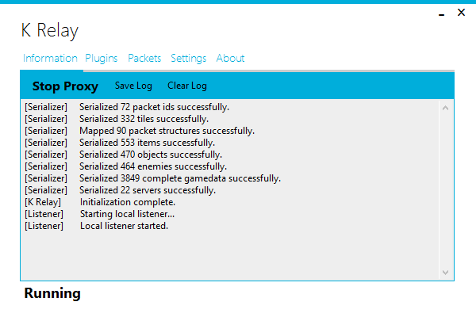
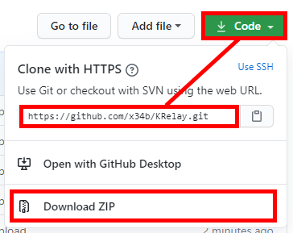

# KRelay (by Kronks, updated by x34)
A modular Realm of the Mad God man-in-the-middle Proxy\
Main github repo: https://github.com/TheKronks/KRelay \

It's also important to download safe versions of KRelay. Do not download any program which has a high warning on either Jotti or Virustotal \

Links for this program: \
**Virustotal**: https://www.virustotal.com/gui/file/f9ac1441acd3ef43570d5b3073963cfce43b4f8e5b3cdc51c87a4079e31faf48/summary \
**Jotti**: https://virusscan.jotti.org/en-GB/filescanjob/fkehclsyty \
Feel free to run it through both or either yourself if you are in any worries.

### What's it's purpose?
As a MITM proxy, it allows you to make custom plugins, or use existing plugins. These include: trade bots, spam bots etc. You can find Kronk's documentation here: https://github.com/TheKronks/K_Relay_Plugin_Documentation [Requirements: Visual Studio C# (for plugins)]

### Issues
If there are any updates/problem, upon an issue.

### Known Bugs
- Not starting proxy\
Fix: Launch RotMG or restart the program a couple of times\
- 3-4 minute wait time.\
Fix: Wait for 3-4 minutes after launch, then restart after that. Doesn't always work but may fix the issue.\

### How to download

There are two ways to download:\
- Cloning the repo with git (https://git-scm.com/) or;\
- Downloading the zip/rar file;\

You can clone with git by using: `git clone https://github.com/x34b/KRelay.git`
